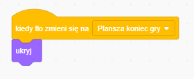

Among Us na platformie Scratch 3.0

# Gra Among Us na platformie Scratch 3.0

## Opis gry

Gra swoim motywem nawiązuje do bardzo popularnej w wśród dzieci i młodzieży (rok 2021) gry Among Us. Jest to strategiczna gra wieloosobowa w której gracze dzielą się na członków załogi (ang. crewmates) oraz od 1 do 3 oszustów (ang. impostors). Zadaniem członków załogi jest wykonywanie zadań na statku, a zadaniem oszustów – sabotowanie misji i eliminowanie członków załogi. Załoga na początku gry otrzymuje informację, ilu oszustów jest na statku. Są oni eliminowani poprzez demokratyczne głosowania, podczas których członkowie załogi konsultują się i na podstawie swoich obserwacji wyłaniają podejrzanych. Osoby, które uzyskały najwięcej głosów, giną. Gdy wszyscy oszuści zostaną zlikwidowani lub gdy członkowie wykonają wszystkie zadania, wygrywa załoga. Gdy oszuści wyeliminują dużą część załogi lub zniszczą ważne części statku, wygrywają.

Gra stworzona na platformie Scratch jest grą zręcznościową ćwiczącą refleks i szybkie podejmowanie decyzji i skupia się na eliminowaniu impostorów zanim zdążą dostać się na pokład statku kosmicznego. impostorzy wyglądają jak członkowie załogi za wyjątkiem jednego szczegółu – w swoim plecaku próbują przemycić broń. Kliknięcie na postać powoduje wyrzucenie jej w przestrzeń kosmiczną. Gracz musi jednak uważać - przez przypadek może wyeliminować członka załogi. Gracz może pomylić się 3 razy – wpuścić impostora na pokład lub wyrzucić członka załogi. Każda prawidłowa decyzja nagradzana jest przyznaniem punktu.

Gra dostępna jest pod linkiem: [https://scratch.mit.edu/projects/494038652/](https://scratch.mit.edu/projects/494038652/)

Wszystkie zasoby graficzne znajdują się [tutaj](./zasoby/).

Podobna gra oparta o motyw Mario dostępna jest pod linkiem: https://scratch.mit.edu/projects/502078811/

## Przygotowanie sceny i kosmity

Po zalogowaniu się do konta klikamy na przycisk Nowy projekt.


W nowym projekcie automatycznie dodawane są elementy które nie będą nam potrzebne, dlatego usuwamy domyślnego duszka „Duszek 1" i zmienną „moja zmienna"


Dodajemy tło „Plansza gry.png"


Usuwamy również domyślne tło:


W celu dodania nowego duszka, najeżdżamy na ikonkę (nie klikamy!) i wybieramy opcję Wczytaj duszka. Dodajemy duszka „Kosmita 1.png".


Kosmita zostanie dodany do planszy. Zmieniamy nazwę duszka z Kosmita 1 na Kosmita:


## Tworzenie klonów i animacja ruchu

Klikamy na duszka Kosmita i klikamy na zakładkę Skrypty. Tworzymy akcję, która ma wykonać się po rozpoczęciu gry. Jako, że nasz kosmita ma służyć jedynie jako szablon dla klonów, po uruchomieniu gry ukrywamy go i zaczynamy tworzyć jego klony. Dodajemy bloki:

```
Kontrola -> kiedy kliknięto (flaga)
Wygląd -> ukryj
Kontrola -> zawsze
Kontrola -> utwórz klona z siebie
Kontrola -> czekaj 1 sekunda
```


Po uruchomieniu gry zobaczymy niewiele. Nasz dodany kosmita zniknie. Dodajmy więc akcję, która ma się wykonać po tym jak utworzymy nowego klona:
```
Kontrola -> gdy zaczynam jako klon
Wygląd -> pokaż
Ruch -> idź do x: -240, y: -90
Ruch -> leć przez 2 sekund do y: 250 x: -90
Kontrola -> usuń tego klona
```


> W grze istotne jest zrozumienie współrzędnych. Punk (0;0) to środek planszy gry. Plansza gry ma rozdzielczość 480x360px, więc prawa krawędź będzie miała współrzędą x=240, a górna krawędź y=180.

W tym momencie można uruchomić grę i sprawdzić pierwsze efekty. Zobaczymy, że co sekundę pojawia się nowy kosmita i leci po moście do statku.

Możemy utworzyć prostą animację, w której nasz kosmita będzie biegł (a nie latał).

Dodajemy nowy kostium dla naszego kosmity – jego nogi są inaczej ułożone i w momencie, gdy będziemy szybko zmieniać kostium 1 i 2 wywołamy prosty efekt animacji - tak jakby jego nogi się poruszały.

Klikamy na Kosmita, wybieramy zakładkę Kostiumy, najeżdżamy na ikonkę na dole, wybieramy Prześlij kostium. Wybieramy Kosmita 2.


Przechodzimy na zakładkę Skrypty. Dodajmy nowy blok który będzie reagował na zdarzenie utworzenie klona. Uwaga: nie możemy podczepić się pod istniejące zdarzenie, ponieważ kolejne bloki zostaną wykonane dopiero w momencie kiedy skończy się blok „leć przez 2 sekund" czyli w momencie w którym kosmita doleci już do końca planszy.

```
Kontrola -> gdy zaczynam jako klon
Kontrola -> zawsze
Wygląd -> zmień kostium na Kosmita 1
Kontrola -> czekaj 0.1 sekund
Wygląd -> zmień kostium na Kosmita 2
Kontrola -> czekaj 0.1 sekund
```


Po uchronieniu gry zobaczymy, że faktycznie nasz kosmita zaczął biegać. Na razie każdy kosmita wygląda tak samo. Możemy to łatwo zmienić. Do pierwszego skryptu „gdy zaczynam jako klon" dodajmy jako pierwszy blok:

```
Wygląd -> zmień efekt kolor na …
Wyrażenia -> losuj liczbę od 1 do 200
```


Zgodnie z dokumentacją ([https://en.scratch-wiki.info/wiki/Graphic\_Effect#Color\_3](https://en.scratch-wiki.info/wiki/Graphic_Effect#Color_3)) efekt koloru mieści się w przedziale od 1 do 200. Każda liczba oznacza odcień innego koloru. Każdy nowy klon będzie losował dla siebie swój efekt koloru, dzięki temu każdy z kosmita będzie wyglądał inaczej.

## Losowe tworzenie impostorów

Mamy już naszego kosmitę. Ale co z impostorem? Musimy losowo tworzyć kosmitę lub impostora który próbuje dostać się na statek. W tym celu przechodzimy do zakładki Kostiumy i dodajemy 2 nowe kostiumy Impostor 1 i Impostor 2.

Uwaga bardzo istotna jest kolejność kostiumów: Kosmita 1, Kosmita 2, Impostor 1, Impostor 2. W późniejszej części będziemy odnosić się do numeru kostiumu i jeżeli będą one w innej kolejności może to spowodować nieoczekiwane błędy.


impostor różni się od kosmity jednym szczegółem – ma schowaną błoń w plecaku. Po tym gracz będzie mógł rozpoznać, że nie może wpuścić do na pokład statku.

Aby nasz impostor pojawiał się losowo należy zmodyfikować drugi blok, gdy zaczynam jako klon. Zaraz po nim dodajemy:

```
Kontrola =\> jeżeli … to … w przeciwnym wypadku … Tworzenie klonów kosmity
Wyrażenia -\> … = 1
Wyrażenia -\> losuj liczbę od 0 do 1
Wszystkie istniejące skrypty z tego bloku dodajemy do „jeżeli"
```

W sekcji w przeciwnym wypadku duplikujemy skrypty z sekcji „jeżeli" i zmieniamy kostium Kosmita 1 i Kosmita 2 na impostor 1 i impostor 2


Jeżeli wylosowana liczba to 1 wówczas nasza animacja będzie zmieniała kostiumy kosmity, jeżeli 0 (w przeciwnym wypadku) będziemy animowali kostiumy impostora. Możemy upewnić się, że wszystko działa jak należy uruchamiając grę.

## Zdobywanie punktów i tracenie szans

Kolejnym etapem jest zbieranie punktów oraz traceniem szans. Punkty zdobywa się gdy kosmita dotrze do drzwi i kiedy uda się nam wyrzucić impostora w przestrzeń kosmiczną. Szanse tracimy, gdy na statek dostanie się impostor lub gdy przez przypadek wyrzucimy w przesteń kosmiczną kosmitę.

Pierwszym krokiem jest dodanie zmiennych, które będą przechowywać tę informację.

```
Zmienne -> Utwórz zmienną -> Punkty (dla wszystkich duszków)
Zmienne -> Utwórz zmienną -> Szanse (dla wszystkich duszków)
```


Warto upewnić się, że zmienne są widoczne na ekranie gracza – kliknięcie na znacznik przy nazwie zmiennej powoduje, że jest ona widoczna na ekranie w czasie gry.

Domyślnie, zmienne mają wartość 0. Należy ustawić ich początkowe wartości przy uruchomieniu gry. Klikamy na scenę i przechodzimy na zakładkę Skrypty (początkowe wartości zmiennych można ustawiać również na Skryptach duszków, jednak dobrą praktyką jest ustawianie zmiennych startowych na scenie).

```
Zdarzenia -\> kiedy kliknięto (flaga)
Zmienne -\> ustaw Punkty na 0
Zmienne -\> ustaw Szanse na 3
```


Kolejnym krokiem jest dodanie elementu, który będzie wyznaczał nam moment dojścia do drzwi.

Najeżdżamy na przycisk dodania duszka i wybieramy Wczytaj duszka i wybieramy Wejście na statek.


Przeciągamy lub ustawiamy pozycję wejścia na x: 205 y: -116 (jak na rysunku powyżej). Klikamy na duszka Kosmita (w jego kontekście będziemy tworzyć kolejny skrypt) i dodajemy kolejny (już 3) blok gdy zaczynam jako klon:

```
Kontrola -\> gdy zaczynam jako klon
Kontrola -\> zawsze
Kontrola -\> jeżeli … to
Czujniki -\> dotyka Wejście na statek?
Kontrola -\> jeżeli … to … w przeciwnym wypadku …
Wyrażenia -\> … lub …
Wyrażenia -\> … = 1
Wygląd -\> kostium liczba
Wyrażenia -\> … = 2
Wygląd -\> kostium liczba
Zmienne -\> zmień Punkty o 1
Zmienne -\> zmień Szanse o -1
Wygląd -\> ukryj
```


## Plansza zakończenia gry

Po uruchomieniu gry zobaczymy, że kosmita, który doszedł do drzwi faktycznie zwiększa ilość punktów, a impostor zmniejsza ilość szans. Ale nadal nic się nie dzieję, gdy ilość szans jest równa lub mniejsza 0. W takim wypadku powinien pojawić się komunikat o końcu gry.

W tym celu dodajemy nowe tło Plansza koniec gry.png:


Aby gra wiedziała jakie tło ustawić jako początkowe przechodzimy do skryptów tła i modyfikujemy istniejący skrypt:

```
Wygląd -> zmień tło na Plansza koniec gry
```


Oraz dodajemy nowy blok który będzie monitorował ilość szans które pozostały graczowi

```
Kontrola -\> zawsze
Kontrola -\> jeżeli to …
Wyrażenia -\> … = 0
Zmienne -\> Szanse
Wygląd -\> zmień tło na Plansza koniec gry
Kontrola -\> zatrzymaj wszystko
```


Gdy sprawdzimy, czy gra działa okaże się, że wszystko działa prawie dobrze. Jedyny problem to żółty znacznik wejścia na statek. Musimy również go ukryć, gdy gra się skończy. Klikamy na wejście na statek i przechodzimy do zakładki skrypty.

```
Zdarzenia -> kiedy tło zmieni się na Plansza koniec gry
Wygląd -> ukryj
```



## Główna mechanika gry

Nadal jednak nie mamy tego co najważniejsze – możliwości „wyrzucenia" impostora. Chcielibyśmy, aby kliknięcie na niego, gdy próbuje dostać się na statek, powodowało wyrzucenie do w przestrzeń kosmiczną. W tym celu klikamy na duszka Kosmita i dodajemy skrypt:

```
Zdarzenia -\> kiedy ten duszek kliknięty
Kontrola -\> zatrzymaj inne skrypty duszka
Kontrola -\> jeżeli … to … w przeciwnym wypadku …
Wyrażenia -\> … lub …
Wyrażenia -\> … = 1
Wygląd -\> kostium liczba
Wyrażenia -\> … = 2
Wygląd -\> kostium liczba
Zmienne -\> zmień Szanse o -1
Zmienne -\> zmień Punkty o 1
Ruch-\> leć przez 0.5 sekund do x: 0 y: 200
Kontrola -\> usuń tego klona
```


Po kliknięciu na kosmitę lub impostora, postać wylatuje w przestrzeń kosmiczną. Jeżeli był to impostor otrzymujemy punkt, jeżeli kosmita – tracimy szansę.

**Gratulacje! Gra skończona!**

## Zadania dodatkowe

- Dodanie muzyki i efektów dźwiękowych
- Wraz z postępem gry zmiana częstotliwości występowania impostorów
- Wraz z postępem gry przyspieszenie generowania postaci i zwiększanie prędkości poruszania się
- Losowe pojawianie się specjalnego kosmity którego kliknięcie odnowi ilość szans do trzech.
